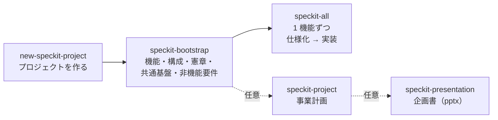

# 利用マニュアル

speckit のコマンドとスキルの使い方をまとめた、利用者向けの説明書。仕組みや設計の詳細は [README.md](README.md) と各スキルの `SKILL.md` にある。

## 目次

1. [全体の流れ](#1-全体の流れ)
2. [準備](#2-準備)
3. [最小の手順（新しいプロジェクトを作って実装まで）](#3-最小の手順新しいプロジェクトを作って実装まで)
4. [立ち上げ（speckit-bootstrap）](#4-立ち上げspeckit-bootstrap)
5. [仕様化と実装（speckit-all / speckit-feature / speckit-coding）](#5-仕様化と実装speckit-all--speckit-feature--speckit-coding)
6. [事業計画（speckit-project）](#6-事業計画speckit-project)
7. [企画書（speckit-presentation）](#7-企画書speckit-presentation)
8. [エージェントごとの呼び出し方](#8-エージェントごとの呼び出し方)
9. [scaffold の更新を取り込む（new-speckit-project update）](#9-scaffold-の更新を取り込むnew-speckit-project-update)
10. [既存のプロジェクトに取り込む（new-speckit-project adopt）](#10-既存のプロジェクトに取り込むnew-speckit-project-adopt)
11. [Windows で使う場合](#11-windows-で使う場合)
12. [困ったとき](#12-困ったとき)
13. [早見表](#13-早見表)

---

## 1. 全体の流れ



- **new-speckit-project**: scaffold から新しいプロジェクトを作り、AI エージェントを起動する。
- **speckit-bootstrap**: エージェントとの対話で、コアコンセプトから機能の一覧、アーキテクチャ、憲章、共通基盤、非機能要件までを作る。
- **speckit-all**: 機能を 1 件ずつ、仕様化から実装、レビュー、`main` へのマージまで進める。
- **speckit-project**（任意）: 市場規模、収支、KPI、スケジュールなどの事業計画を作る。
- **speckit-presentation**（任意）: 成果物から企画書の PowerPoint を作る。

どのスキルも、決める必要があることはエージェントが選択肢と推奨案を示して質問する。答えながら進めればよい。

## 2. 準備

### 必要なもの

| もの | 用途 | 入れ方の例 |
|---|---|---|
| Git | バージョン管理 | macOS: `xcode-select --install`、Windows: [Git for Windows](https://gitforwindows.org/) |
| Python 3.9 以上 | スクリプトの実行 | macOS / Windows: [python.org](https://www.python.org/downloads/) など |
| uv | コマンドの導入、企画書の生成 | [uv のインストール手順](https://docs.astral.sh/uv/getting-started/installation/) |
| AI エージェントの CLI | 対話で作業を進める | Claude Code、Codex CLI、Antigravity、Kiro CLI、opencode のいずれか 1 つ以上 |
| GitHub CLI（gh） | クラウドセッションで立ち上げるとき（`--cloud`）だけ使う | [gh のインストール手順](https://cli.github.com/)。入れた後に `gh auth login` |

Git には名前とメールアドレスを設定しておく。

```bash
git config --global user.name "あなたの名前"
git config --global user.email "あなたのメールアドレス"
```

### コマンドを入れる（初回だけ）

```bash
uv tool install "git+https://github.com/sfukuda84/speckit#subdirectory=tool"
```

`new-speckit-project --version` で版が表示されれば完了。新しい版にするときは次のコマンドを使う。

```bash
uv tool upgrade new-speckit-project
```

## 3. 最小の手順（新しいプロジェクトを作って実装まで）

### ステップ 1: プロジェクトを作る

```bash
new-speckit-project ~/work/my-app -m "小規模な美容室向けの予約管理サービス。電話と LINE の予約を 1 画面で管理し、ダブルブッキングを防ぐ。"
```

- `~/work/my-app` は作るプロジェクトのディレクトリ（存在しないか、空であること）。
- `-m` はサービスのコアコンセプト。誰の、どんな課題を、どう解決するかを書く。省くと、実行後に入力を求められる。
- 既定では Claude Code が起動する。別のエージェントを使うなら `--agent codex` のように指定する（§8）。

### ステップ 2: 立ち上げの質問に答える

エージェントが起動し、`speckit-bootstrap` が自動で始まる。エージェントの質問に答えていくと、次の順に成果物ができる（詳しくは §4）。

1. 機能の一覧（`docs/feature/`）
2. アーキテクチャと技術選定（`docs/architecture.md`）
3. 憲章（`.specify/memory/constitution.md`）
4. 共通基盤（`docs/feature/000-app-basic.md`）
5. 非機能要件（`docs/nfr.md`、`docs/feature/999-app-nfr.md`）

終わると「次は `speckit-all` で進める」と案内される。

### ステップ 3: すべての機能を仕様化して実装する

同じエージェントで、次のように依頼する（Claude Code の場合）。

```text
/speckit-all all
```

`000-app-basic` から着手順に 1 件ずつ、仕様化 → 実装 → レビュー → `main` へのマージを繰り返す。途中でエージェントが質問してきたら答える。1 件ずつ進めたいときは `/speckit-all`（引数なし）で次の 1 件だけを進める。

> 途中で止まっても、もう一度 `/speckit-all all` を実行すれば、止まったところから続きを始める（§5）。

## 4. 立ち上げ（speckit-bootstrap）

`new-speckit-project` が自動で始めるが、手動で始めるときは `/speckit-bootstrap` と打つ。

| ステップ | 何をするか | 主に聞かれること | 成果物 |
|---|---|---|---|
| B1 機能への仕分け | コンセプトを、仕様化できる大きさの機能に分ける。競合も調べる | 利用者、主な業務の流れ、MVP の範囲、課金の方針、やらないこと | `docs/feature/001-*.md` ほか、`docs/concept/competitor.md`、`backlog.md` |
| B2 アーキテクチャ | SaaS/PaaS・クラウド・VPS の 3 案を月額の概算付きで比べ、選ぶ | 使いたいクラウド、予算、運用の体制、得意な言語 | `docs/architecture.md` |
| B3 憲章 | すべての判断の基準になる原則を決める | テストの方針など | `.specify/memory/constitution.md` |
| B4 共通基盤 | 認証やメール送信など、どのサービスにも要る機能をまとめる | MVP に入れる共通機能 | `docs/feature/000-app-basic.md` |
| B5 非機能要件 | 稼働率、応答時間、セキュリティ、監視、バックアップなどの目標を決める | 可用性やコストの目標 | `docs/nfr.md`、`docs/feature/999-app-nfr.md` |
| B5-1 デザイン | 見た目（色、文字、余白、部品）と振る舞い（画面一覧、状態の表示、言葉づかい、アクセシビリティ）の共通の決め事を作る | 与えたい印象、参考にしたいサービス、主な端末、ダークモードの要否 | `docs/design/DESIGN.md`、`EXPERIENCE.md`、`tokens.tokens.json` |
| B6 検証 | 全体の食い違いがないか確かめ、環境と設定を診断する（`worktree_helper.py doctor`） | — | — |

- ステップごとにコミットされるので、途中でやめても `/speckit-bootstrap` を再実行すれば続きから始まる。

### 質問を減らす（`--auto` / `--oneshot`）

| 指定 | 例 | 動き |
|---|---|---|
| なし | `/speckit-bootstrap` | 上の表の質問に、ステップごとに答える |
| `--oneshot` | `/speckit-bootstrap --oneshot` | 最初に一度だけ、予算、クラウドと言語の希望、MVP の範囲、課金などのうち、コンセプトに書いていないものを最大 4 問まとめて聞く。以降は質問せずに進める |
| `--auto` | `/speckit-bootstrap --auto` | 一度も質問せず、エージェントの推奨案を採用して最後まで進める |

- `new-speckit-project` に `--auto` か `--oneshot` を付けると、そのモードで立ち上げが始まる。
- 自動で決めたことは仮定として `docs/auto-decisions.md` に記録される。見直しの優先度が「高」のもの（予算、課金、MVP の範囲、アーキテクチャなど）は、必ず見直す。変えるときは、記録にあるスキル（`speckit-architecture` など）の更新モードを使う。
- 前提をコンセプトに書いておくほど、推奨案は的確になる。`--auto` でも、`/speckit-bootstrap --auto 予算は月 1 万円まで、AWS を使いたい` のように引数で足せる。
- ブランチが `main` でない場合（クラウドセッションでは、セッションの作業ブランチでよい）や、検証のエラーが直らない場合は、自動でも止まる。対処してから再実行すれば続きから始まる。
- 番号 `000` は共通基盤、`999` は運用基盤の予約番号で、コアの機能は `001` から振られる。

### クラウドセッションで立ち上げる（`--cloud`）

Claude Code のクラウドセッション（claude.ai/code）で立ち上げたいときは、`--cloud` に GitHub のリポジトリ名を付ける。PC を閉じても作業が続き、スマートフォンからも様子を見られる。

```bash
new-speckit-project ~/work/my-app -m "コアコンセプト" --cloud me/my-app
```

- プロジェクトはローカルで作る。その後、GitHub に非公開のリポジトリ `me/my-app` を作って `main` を push し、`claude --cloud` でクラウドセッションを始める。空の既存リポジトリを指定したときは、そこに push する。空でないリポジトリを指定すると、何も作らずに止まる。
- 事前に、GitHub CLI（gh）でログインしておく。クラウドセッションが結果を push できるように、Claude GitHub App をリポジトリに入れるか、Claude Code で `/web-setup` を実行しておく。
- `--auto` も `--oneshot` も付けなければ、`--oneshot` で進める。クラウドでは、しばらく経ってから質問に答えると回答が効かないことがあるためである。
- 成果は、セッションの作業ブランチ（`claude/...`）に push される。確かめてから、PR で `main` に取り込む。
- push に失敗したときは、ローカルのプロジェクトを残したまま止まり、続きの手順（`git push` と `claude --cloud`）を表示する。
- `--cloud` を付けなければ、これまでどおりローカルでエージェントを起動する。

クラウドセッションでスキルを使うときは、次の点がローカルと違う。スキルは、クラウドセッションだけに設定される環境変数 `CLAUDE_CODE_REMOTE=true` を見て、動きを切り替える。

| 項目 | ローカル | クラウドセッション |
|---|---|---|
| `speckit-feature` / `coding` / `all` のマージ先 | `main`（`SPECKIT_MAIN_BRANCH` で変えられる） | セッションの作業ブランチ。マージの後に push する。`main` へは PR で取り込む |
| 中断と再開 | worktree が残っていれば、続きから再開できる | 操作のないまましばらく経つと VM が消え、push していない worktree やブランチも消える。1 つのフィーチャーは 1 つのセッションで最後まで進める |
| 質問 | 対話で答えられる | `--auto` か `--oneshot` がよい |
| 出典付きの Web 調査 | そのまま使える | ページを開けない（WebFetch が止められる）ことがある。そのときは検索結果で進め、開けなかった出典はその旨を書く |
| `.github/workflows/` の変更 | そのまま push できる | push を拒否されることがある。拒否されたら `[人]` のタスクにして、ローカルで反映する |

## 5. 仕様化と実装（speckit-all / speckit-feature / speckit-coding）

### 3 つのスキルの違い

| スキル | 範囲 | 使う場面 |
|---|---|---|
| `speckit-all` | 仕様化から実装、マージまで通しで | 普段はこれを使う |
| `speckit-feature` | 仕様化まで（specify、clarify ×2、画面仕様、plan、tasks、analyze ×3。回数は機能の重さで減る）して `main` にマージ | 仕様だけ先に固めて、レビューや承認を挟みたいとき |
| `speckit-coding` | 実装から（implement、converge、レビュー ×2。軽の機能は 1 回）して `main` にマージ | `speckit-feature` で仕様をマージした機能を実装するとき |

### 引数

| 指定 | 例 | 動き |
|---|---|---|
| なし | `/speckit-all` | 次に着手すべき 1 件 |
| 番号 | `/speckit-all 3` または `/speckit-all 003` | その 1 件 |
| 範囲 | `/speckit-all 002-005` | 範囲内を 1 件ずつ順に |
| すべて | `/speckit-all all` | 残りをすべて 1 件ずつ順に |
| 自動 | `/speckit-all all --auto` | 上と組み合わせる。質問せずに、エージェントの推奨案を採用して進める |
| モック | `/speckit-all 3 --with-mock` | 上と組み合わせる。画面仕様で、Claude Design のモックも作って案を選ぶ |
| 重さ | `/speckit-all 3 --weight 軽` | 上と組み合わせる。機能ファイルの重さの代わりに、指定した重さで進める（下の「機能の重さ」） |

着手の順番は `docs/feature/spec_order.md` の並び順に従う。

### 自動モード（`--auto`）

`--auto` を付けると、clarify の質問、設計判断、レビュー指摘の対応方針などを質問せずに、エージェントが示す推奨案を採用して進める。`speckit-feature` と `speckit-coding` でも使える。

- 自動で決めたことは、機能ごとに `specs/<番号-名前>/auto-decisions.md` に記録される。clarify の回答には `(auto)` の印が付く。終わったら一覧を見直し、変えたいものは `/speckit-clarify` などで直す。
- マージの競合、中止、憲章やアーキテクチャの変更が必要な場合、テストが直らない場合などは、自動モードでも止まる。範囲指定や `all` では、止まった機能（とそれに依存する機能）を飛ばして次に進み、最後に判断してほしい事項を報告する。判断した後にもう一度実行すれば、続きから再開する。

### 質問のタイミング

対話で進めるときも、質問はステップごとには来ない。次の 3 か所にまとまって来る。

| いつ | 何を聞かれるか | 量 |
|---|---|---|
| 仕様を書く前（窓 1） | 作る範囲、前提、利用者と権限 | 最大 3 回、1 回に最大 4 問 |
| 設計の前（窓 2） | clarify の論点、画面の構成、それまでに仮に決めたこと | 最大 3 回、1 回に最大 4 問 |
| 実装を終えたとき（S8 の終わり） | 設計と実装の途中でエージェントが推奨案で決めたこと（`specs/<番号-名前>/decisions.md`） | 1 回。件数の上限なし。推奨案のままでよければ「そのままで」と答える |

- 窓の 2 回目と 3 回目は、回答から新しい論点が出たときだけ来る。
- 軽の機能では、窓 2 は来ない（その分は S8 の終わりにまとめて確かめる）。
- 作る対象の取り違えや、憲章・アーキテクチャの変更が要る場合だけは、途中でも止まって聞かれる。
- S9 以降（収束とレビュー）でエージェントが決めたことは、質問せずに完了報告に載る。

### 機能の重さ

機能ファイル（`docs/feature/<番号-名前>.md`）のヘッダの `**重さ**`（`軽` / `標準` / `重`）で、工程の回数が変わる。小さな機能に、大きな機能と同じ手間をかけないためである。

| 工程 | 軽 | 標準 | 重 |
|---|---|---|---|
| clarify | 1 回 | 2 回 | 2 回 |
| 画面仕様 | 画面があるときだけ | 画面があるときだけ | 必ず（画面がなければ「UI なし」） |
| analyze | 1 回 | 2 回 | 3 回 |
| レビュー | 1 回 | 2 回（2 回目は修正の差分だけ） | 2 回 |

- **重**: データモデル・保存するデータの形、外部に公開する契約（API など）、認証と権限、お金、個人情報のどれかに触れる機能。共通基盤（`000-app-basic`）は重である。
- **軽**: 画面だけ、文言だけ、設定だけの機能。
- **標準**: それ以外。
- 重さは機能を仕分けるとき（`speckit-concept-2-feature`）に書かれる。欄がない機能は、仕様化を始めるときにエージェントが判定して書き足す（欠けている間は標準）。迷ったら重い方にする。
- レビューで直す指摘は、1 軸あたり 15 件までは LOW も含めて全件である。15 件を超えると、LOW は直さずに `specs/<番号-名前>/reviews/backlog.md` に送られる（後でまとめて片付ける）。2 回目のレビューで CRITICAL・HIGH が 0 件なら、3 回目は行わない。直しても CRITICAL・HIGH が残るときは、止まって判断を求められる。
- 省いたステップも「省略」として記録されるので、中断と再開は変わらない。進捗の表には「（省略: S4 S7-2）」のように出る。

### 画面仕様とモック（`--with-mock`）

clarify の後、plan の前に、画面仕様（`specs/<番号-名前>/ui.md`）を作る。画面と要件（FR）の対応、画面ごとの表示・操作・入力・状態・文言を書く。見た目と振る舞いの共通の決め事は、立ち上げ（B5-1）で作った `docs/design/` に従う。画面のない機能は、重の機能なら「UI なし」と記録して進み、軽・標準の機能なら画面仕様を省く。

- 標準では、テキストの画面仕様だけを作る。
- `--with-mock` を付けると、Claude Code の `/design`（Claude Design）で主な画面のモックを作り、案を選んでから仕様に反映する。モックの URL は `ui.md` に残るが、正本は `ui.md` と `docs/design/` である。
- Claude Design は Claude の通常の利用枠を使い、消費が大きい。モックは主な画面 1〜2 枚に絞られる。
- `/design` を使えない環境（Claude Code 以外のエージェント、アーティファクトを使えないアカウント、`/design` がエラーになるクラウドセッション）では、テキストの仕様だけで進み、理由が報告される。
- 画面仕様の工程を足す前に仕様化した機能には `ui.md` がない。実装を始めるときに `MISSING_ARTIFACTS: ui.md` と表示され、エージェントが実装の前に作る。
- 共通のコンポーネントを実装した後（多くは `000-app-basic` の後）に、Claude Code で `/design-sync` を実行すると、実際のコンポーネントが Claude Design に取り込まれ、以後のモックがそろう。

### 作業の分担とレビューの記録

Claude Code のようにサブエージェントを使えるエージェントでは、実行中のエージェント（親）が質問・判断・コミット・マージを受け持ち、実装（Phase ごと）、収束、レビュー、指摘の修正をサブエージェントに任せる。親の会話が長くなりすぎるのを防ぐためである。

- レビューは、Standards 軸と Spec 軸ごとに、実装の経緯を知らないサブエージェントが独立に審査する。親は指摘の根拠を確かめてから、直すかどうかを決める。
- レビューの記録は `specs/<番号-名前>/reviews/review-<回>.md` に残る。直さなかった指摘も、理由と一緒に残る。
- サブエージェントを使えないエージェントでは、親が同じ順で自分で行う。

### 作業の場所

機能ごとに `.worktrees/<番号-名前>`（ブランチ `feature/<番号-名前>`）という別の作業ディレクトリを作って作業し、終わったら `main` にマージして片付ける。普段の作業ディレクトリ（`main`）は、作業中も汚れない。

### 中断と再開

- 各ステップが終わるたびにコミットして、進捗を記録している。
- エージェントを閉じても、別のエージェントに替えても、同じスキルを再実行すれば、止まったステップから続きを始める。再開する前に、どこから再開するかの確認がある。
- 再開するとき、エージェントは `worktree_helper.py resume <番号>` で、次のステップ、残りのタスク、まだ確かめていない判断を記録から読み直す。引き継ぎのために進捗を書いた文書は作らない（書くと、更新漏れで記録と食い違うため）。
- 途中で区切るときだけ、エージェントが作業中のメモ（`specs/<番号-名前>/handover.md`。止めた理由、次の一手、試して駄目だったこと）を残す。メモは機能をマージするときに自動で消え、`main` には残らない。メモを書いた後に作業が進んでいれば、「メモが古い」と警告が出る。
- 次の機能でも踏みそうな罠は、`docs/pitfalls.md` に一時的に置かれる。10 件を超えるか、書いてから 3 機能を終えると、ルール（steering など）に移すか消すかの棚卸しを求められる。

### 環境を確かめる・コマンドを決める

うまく動かないときは、エージェントに「環境を確かめて」と頼むか、診断を直接実行する。

```bash
python3 .claude/skills/speckit-worktree/scripts/worktree_helper.py doctor
```

Python の版、`.gitignore`、スキルのリンク、憲章、テストやビルドのコマンドが使えるかを確かめ、`ERROR` があれば直し方が案内される。

テスト・リンター・ビルドのコマンドは `.specify/commands.json` にまとめて記録され、エージェントは常にここを見る。最初の機能（多くは `000-app-basic`）でエージェントが記録する。自分で変えるときは次のようにする。

```bash
python3 .claude/skills/speckit-worktree/scripts/worktree_helper.py commands set test 'npm test'
python3 .claude/skills/speckit-worktree/scripts/worktree_helper.py commands            # 一覧
```

### 進捗を見る・やめる

エージェントに「フィーチャーの進捗を見せて」と頼むか、スクリプトを直接実行する。

```bash
python3 .claude/skills/speckit-worktree/scripts/worktree_helper.py status
```

```text
| FEATURE | 仕様 | 実装 | WORKTREE | 人の作業 | 後の作業 |
|---|---|---|---|---|---|
| 000-app-basic | 完了 | 完了 | - | 残り 1 件 | 残り 2 件 |
| 001-salon-setup | 完了（未マージ） | 作業中 | あり（次: S10） | - | - |
| 002-customer-records | 未着手 | - | - | - | - |
```

作業中の機能をやめて捨てるときは、エージェントに「001 の作業を破棄して」と頼む（確認のうえで破棄される）。

### マージの前に確認されること

最後のマージ（片付け）の前に、次の場合は止まって確認を求められる。

| 表示 | 意味 | どうするか |
|---|---|---|
| `UNCHECKED_TASKS` | `tasks.md` に終わっていないタスク（`[人]`・`[後]` 以外）がある | 実装するか、残したままマージするかを答える |
| `LEFTOVER_CHANGES` | どのステップにも含まれない変更がある | マージに含めてよいかを答える |
| `NOT_ON_MAIN` | 普段の作業ディレクトリが `main` 以外のブランチにいる | `main` に切り替えてよいかを答える |

マージのときに、作業ディレクトリにあった `.env` などの無視対象のファイルも消える。消えるファイルは報告されるので、必要なら控えておく。

止まらずに表示だけされるものもある。

| 表示 | 意味 |
|---|---|
| `HUMAN_TASKS_PENDING`・`DEFERRED_TASKS_PENDING` | `[人]`・`[後]` のタスクが残ったままマージした（下の「人が行うタスク」「後の段階に回すタスク」） |
| `HANDOVER_REMOVED` | 作業中のメモを消した。残すべきことは、エージェントが決めたことの台帳や落とし穴の受け箱に移す |
| `PITFALLS_TRIAGE` | 落とし穴の受け箱に、棚卸しが要る項目がある（§5「中断と再開」） |

### 人が行うタスク

契約、支払い、アカウントの作成、秘密情報の入力、外部サービスの管理画面での操作、実機での確認など、AI が行えないタスクは、`tasks.md` で `[人]` が付く（例: `- [ ] T001 [US1] [人] 本番のドメインを取得する（完了の確かめ方: T002 が通る）`）。

- AI は `[人]` のタスクを実行せず、手順を示して先に進む。自動モードでも、勝手に完了にはしない。
- 終わっていないタスクが `[人]` だけなら、確認なしに `main` にマージする。機能の状態は `人の作業待ち` になり、残りのタスクが報告される。
- 残りは「人の作業を一覧して」と頼むか、`worktree_helper.py human-tasks` で見られる。
- 作業が終わったら、エージェントに「T001 が終わった」のように伝える。エージェントが確かめられる部分を確かめて `tasks.md` を完了にし、`sync-status` で状態を `完了` にする。

### 後の段階に回すタスク

MVP には要らない作業や、ほかの機能の実装を待つ作業を、仕様で「後でやる」と決めたときは、`tasks.md` で `[後]` が付く（例: `- [ ] T045 [US2] [後] 本番の監視の通知先を足す（いつ: 公開時）`）。

- 終わっていないタスクが `[人]`・`[後]` だけなら、確認なしに `main` にマージする。機能の状態は `完了（後の作業 N 件）` になる。
- 残りは「後の作業を一覧して」と頼むか、`worktree_helper.py deferred-tasks` で見られる。
- その段階が来たら、`/speckit-coding 001 --deferred`（特定のタスクだけなら `--deferred T045,T046`）で片付ける。専用の作業ディレクトリ（`.worktrees/001-xxx-deferred`）で、実装・収束・レビューを対象のタスクだけに行い、`main` にマージする。

### 一部だけを先に作る

ほかの機能の前提として、ある機能の一部（例: `000-app-basic` の認証の部分）だけを先に入れたいときは、`/speckit-coding 000 --until "Phase 2"` で、`tasks.md` のその Phase までを実装して `main` にマージする。残りは後で `/speckit-coding 000` を実行すれば続きから進む。進捗の表には「（一部をマージ済み）」と出る。

## 6. 事業計画（speckit-project）

市場規模、価格と収支、KPI、スケジュール、体制、リスクをまとめ、`docs/project.md` に書く。企画書の材料になる。

### 使い方

```text
/speckit-project
```

立ち上げ（§4）の後に実行すると、機能の一覧と構成の費用を使って計画を作れる。重点を置きたいことがあれば、引数で伝える（例: `/speckit-project 資金調達を前提にしたい`）。

### 聞かれること

- 計画の期間と、目指す姿（例: 3 年で黒字の小規模サービス）
- 価格（競合の価格帯を示して、候補を提案される）
- 体制（誰が、週何時間関わるか）と人件費の扱い
- 顧客数の見込み（楽観・標準・悲観）、広告などの費用、初期投資
- 必要資金の調達方法
- KPI と、見直し・撤退の基準

市場規模などの客観的な数字は、エージェントが Web で調べて出典と参照日を付ける。

### できるもの

`docs/project.md` に、市場規模（TAM・SAM・SOM）、価格、3 シナリオの収支表、必要資金、KPI、工数とマイルストーン、体制、リスクが書かれる。

### 収支の前提を自分で直す

収支表は手で書かず、前提の表から計算する。前提を直したいときは、`docs/project.md` の `json speckit-plan` のブロック（単価、顧客数の推移、費用など）を書き換えて、次のコマンドで計算し直す。

```bash
python3 .claude/skills/speckit-project/scripts/plan.py docs/project.md --write   # 収支表を計算し直す
python3 .claude/skills/speckit-project/scripts/plan.py docs/project.md --check   # 前提と収支表が一致しているか確かめる
```

前提の書き方:

| 項目 | 意味 |
|---|---|
| `revenue[].unit_price` | 月額の単価 |
| `revenue[].volume` | 期ごとの平均の数量（例: 平均の有料店舗数） |
| `costs[].monthly` | 期ごとの月額の固定費（インフラ、人件費など） |
| `costs[].per_period` | 期ごとにかかる費用（広告、外注など） |
| `costs[].rate` | 売上に対する率（決済手数料など。0.036 は 3.6%） |
| `initial_investment` | 初期投資 |

計画の内容を見直したいときは、`/speckit-project` をもう一度実行する（更新モードになり、変える部分を確認しながら直す）。

## 7. 企画書（speckit-presentation）

成果物から、読み手に合わせた企画書を PowerPoint（.pptx）で作る。事前に `speckit-project` で `docs/project.md` を作っておく。

### 使い方

```text
/speckit-presentation internal
```

| 読み手 | 用途 | 厚くなる内容 |
|---|---|---|
| `internal` | 社内の承認 | 費用、リスク、スケジュール、判断基準 |
| `investor` | 投資家・資金調達 | 市場、成長、収益性 |
| `customer` | 顧客・パートナー | 課題、価値、使い方、価格 |

目的、発表時間、発表で使うか配布するかを聞かれ、スライドの構成案が示される。了承すると作成される。

### できるもの

```text
docs/presentation/
├── design.yaml               # 見た目（色、フォント、雛形）。読み手ごとの版で共通
└── internal/
    ├── slides.md             # スライドの内容と発表者ノート
    └── proposal.pptx         # 企画書
```

### 内容を直す

**pptx を PowerPoint で直接直さない。** pptx は `slides.md` と `design.yaml` から作り直すので、直接直した内容は次に作り直したときに消える。

- エージェントに頼む: 「internal の企画書の 5 枚目を、〜という主張に変えて」
- 自分で直す: `slides.md` を編集し、次のコマンドで作り直す。

```bash
uv run .claude/skills/speckit-presentation/scripts/build_pptx.py docs/presentation/internal/slides.md --check   # 書式と文字量の確認
uv run .claude/skills/speckit-presentation/scripts/build_pptx.py docs/presentation/internal/slides.md           # pptx を作り直す
```

`slides.md` の書き方の要点:

```markdown
<!-- layout: bullets -->
# 見出しは主張にする（例: 手作業の確認に 1 件 30 分かかる）
- 要点
  - 補足（2 字下げで下位の項目）
> 出典: docs/project.md §2

<!-- notes
発表者ノート。スライドに書ききれない説明を書く。
-->

---

<!-- layout: stats -->
# 対象の市場は年 15.7 万件
- **27.3万件** TAM
- **15.7万件** SAM
```

スライドは `---` だけの行で区切る。使えるレイアウトは `title`（表紙）、`section`（章の扉）、`bullets`（箇条書き）、`two-column`（2 段組み）、`table`（表）、`stats`（数値の強調）、`chart`（グラフ）、`image`（画像）、`message`（1 文のメッセージ）。詳しくは `skills/speckit/speckit-presentation/SKILL.md` の §4 と、`templates/slides.md` の見本を見る。

### 色とフォントを変える

`docs/presentation/design.yaml` を編集して作り直す。

```yaml
fonts:
  latin: Arial            # 英数字のフォント
  east_asian: Meiryo      # 日本語のフォント
colors:
  primary: "1F3A5F"       # 見出し、表の見出し行、表紙の背景
  accent: "E07A1F"        # 強調の線、箇条書きの記号
footer:
  text: "社外秘"           # 2 枚目以降の下に入る
logo: images/logo.png     # 右上に入るロゴ（design.yaml からの相対パス）
```

フォントは、開く PC に入っているものにする。Windows と Mac の両方で開くなら Meiryo か Yu Gothic が無難である。

### 会社のテンプレート（雛形の pptx）に差し替える

会社やブランドの PowerPoint の雛形（背景、ロゴ、スライドマスター）を使って作れる。

**1. 雛形を置く**

雛形の .pptx を `docs/presentation/` の下に置く（例: `docs/presentation/templates/brand.pptx`）。

**2. 使うレイアウトの名前を調べる**

雛形の中のスライドレイアウト（「白紙」「タイトルのみ」など）の名前を一覧にする。

```bash
uv run --no-project --with python-pptx python -c "from pptx import Presentation; [print(l.name) for l in Presentation('docs/presentation/templates/brand.pptx').slide_layouts]"
```

背景とロゴだけが入った、文字の枠がないレイアウト（「白紙」など）を選ぶ。

**3. design.yaml に指定する**

```yaml
template: templates/brand.pptx     # design.yaml からの相対パス
template_layout: 白紙               # 手順 2 で調べた名前。省くと、文字の枠が最も少ないレイアウトを使う
```

**4. 作り直す**

```bash
uv run .claude/skills/speckit-presentation/scripts/build_pptx.py docs/presentation/internal/slides.md
```

雛形を使うときの動き:

- スライドの大きさは雛形に合わせる（`design.yaml` の `slide` は使わない）。
- 背景は雛形のものを使い、`design.yaml` の背景色は描かない。表紙と章の扉の文字は、見出しの色（`primary`）で描く。
- 雛形にもともと入っているスライドは取り除かれる。
- 文字の色、フォント、大きさは `design.yaml` の値を使う。雛形の色に合わせたいときは、`colors` をそろえる。

エージェントに「会社の雛形 docs/presentation/templates/brand.pptx を使って作り直して」と頼んでもよい。

### 読み手を増やす


`/speckit-presentation investor` のように別の読み手で実行すると、`docs/presentation/investor/` に別の版ができる。`design.yaml` は共通で使われる。

## 8. エージェントごとの呼び出し方

| エージェント | 起動（new-speckit-project の指定） | スキルの呼び出し方 |
|---|---|---|
| Claude Code | `--agent claude`（既定） | `/speckit-all all` |
| Codex CLI | `--agent codex` | `$speckit-all all` |
| Antigravity | `--agent agy` | `/speckit-all all` |
| Kiro CLI | `--agent kiro` | 「`speckit-all` スキルで all を進めて」と依頼する |
| opencode | `--agent opencode` | 「`speckit-all` スキルで all を進めて」と依頼する |

- エージェントを起動せずに準備だけしたいときは、`--no-launch` を付ける。表示される手順に従って、好きなエージェントで始める。
- Codex を手で起動する場合は、`.git` への書き込み、Web 検索、ネットワークの許可が要る（[README.md](README.md) の「注意点」）。

## 9. scaffold の更新を取り込む（new-speckit-project update）

scaffold にスキルの追加や修正があったとき、作成済みのプロジェクトに取り込める。

```bash
uv tool upgrade new-speckit-project          # コマンド自体を新しくする
cd ~/work/my-app
new-speckit-project update --dry-run         # 何が変わるかだけを見る
new-speckit-project update                   # 取り込んで、1 つのコミットにする
```

- `main` ブランチで、未コミットの変更がない状態で実行する。
- 取り込むのは scaffold の持ち物だけである。
  - スキル（`skills/speckit/` と各エージェントのリンク）
  - Spec Kit のスクリプトとテンプレート
  - ルール（`.kiro/steering/`、`CLAUDE.md`、`AGENTS.md`、`GEMINI.md`、`opencode.json`）
  - `MANUAL.md`、`docs/speckit-scaffold.md`
  - `.gitignore` の足りない行
- 取り込まないもの（プロジェクトの持ち物）は次のとおりで、触らない。
  - `docs/concept/`、`docs/feature/`、`docs/*.md` の成果物
  - `specs/`、憲章、ソースコード、`README.md`
  - 開発コマンド（`.specify/commands.json`）と、落とし穴の受け箱（`docs/pitfalls.md`）
- **手で直したファイルは上書きしない。** scaffold のどの版とも中身が一致しないファイルは、手で直したものとみなして残す。scaffold の新しい版は `.scaffold-new/` に置かれるので、比べて必要な部分を取り込む。

  ```bash
  git diff --no-index .kiro/steering/language.md .scaffold-new/.kiro/steering/language.md
  ```

- scaffold から消えたファイルは、手で直していなければ削除する。プロジェクトで独自に足したスキルなど、scaffold に一度も現れていないファイルは残す。
- 作業中の worktree（`speckit-all` などの途中）がある場合、worktree の中のスキルは、`main` にマージするまで更新前のままである。区切りのよいところで取り込むのがよい。
- 取り込んだ版は `.specify/scaffold.json` に記録される。元に戻すときは、更新のコミットを `git revert` する。

## 10. 既存のプロジェクトに取り込む（new-speckit-project adopt）

speckit を使わずに始めたプロジェクトにも、scaffold を入れて同じ工程で進められる。

```bash
cd ~/work/legacy-app
new-speckit-project adopt --dry-run          # 何が入るかだけを見る
new-speckit-project adopt                    # 取り込む（コミットはしない）
git status                                   # 追加されたファイルを確かめてコミットする
claude "/speckit-bootstrap --adopt"          # 既存の資料とコードから、機能一覧・アーキテクチャ・憲章などを作る
```

- 未コミットの変更がない状態で実行する。git リポジトリでなければ、`git init` だけを行う。
- **既存のファイルは上書きしない。**
  - プロジェクトにないファイル（スキル、Spec Kit のスクリプトとテンプレート、ルール）は追加する。
  - すでにあって中身が違うファイル（既存の `CLAUDE.md` など）は残し、scaffold の版を `.scaffold-new/` に置く。表示される行（`@.kiro/steering/spec-driven-development.md` など）を既存のファイルに足す。
  - `.claude/skills/` などに同じ名前のスキルがあれば残す。scaffold の版に揃えるなら、既存のものを消してから `new-speckit-project update` を実行する。
  - 憲章（`.specify/memory/constitution.md`）があれば触らない。
- 取り込んだ版は `.specify/scaffold.json` に記録されるので、以後は `new-speckit-project update` で更新できる。
- `speckit-bootstrap --adopt` は、ステップごとに「移し替える / 完了として記録 / 新しく作る / 飛ばす」の計画を `docs/adopt-plan.md` に作り、確認してから進める。元の資料は動かさない。
  - 実装済みの機能は、機能ファイルの状態を `実装済み（spec なし）` か `一部実装（spec なし）` にする。`実装済み` の機能は `speckit-all` の対象にならない。
  - アーキテクチャは、既存のコードと設定から現状の構成を書き起こし、「現状を維持する案」を含めて比べる。
  - テストやビルドのコマンドは、`package.json` などから読み取り、実際に動かして確かめてから記録する（`.specify/commands.json`）。
  - `docs/feature/` に番号のない元の資料（例: `mvp1.md`）があれば、動かさずに `docs/feature/README.md` の「メタ文書」の表に載せる。検証（`validate.py`）は、この表のファイルを機能として扱わない。
  - 取り込む前に Spec Kit で仕様化した機能に画面仕様（`ui.md`）がなければ、実装を始めるときに作られる（`MISSING_ARTIFACTS`）。
  - `--auto` や `--oneshot` と組み合わせられる。

## 11. Windows で使う場合

- コマンドは PowerShell でも動く。`new-speckit-project` の使い方は同じ。
- `python3` がない場合は、`python` または `py -3` に読み替える。エージェントは自動で読み替える。

  ```powershell
  py -3 .claude\skills\speckit-worktree\scripts\worktree_helper.py status
  ```

- スキルはシンボリックリンクで共有している。**開発者モード**（設定 → システム → 開発者向け）を有効にしておくとよい。有効でない場合、`new-speckit-project` はスキルを実体のコピーに切り替えて警告を出す。その場合、スキルを更新するときは各エージェントのスキルディレクトリにも反映する必要がある。

## 12. 困ったとき

| 症状 | 原因と対処 |
|---|---|
| `new-speckit-project` で clone に失敗する | ネットワークに接続できるか、`--ref` に指定したブランチやタグがあるかを確かめる |
| `git の user.name と user.email が設定されていません` | §2 の `git config --global` を実行する |
| `speckit-coding` が `SPEC_MISSING` で止まる | 仕様がまだない。先に `speckit-feature` か `speckit-all` を使う |
| `speckit-feature` が `CODING_IN_PROGRESS` で止まる | その機能は実装の途中まで進んでいる。`speckit-coding` か `speckit-all` で再開する |
| マージで競合した | エージェントに競合の内容を確認してもらい、解消方針を答える。解消後にもう一度 `speckit-all` を実行すると、片付けから再開する |
| `ブランチ main がありません` | 既定のブランチが別の名前。環境変数 `SPECKIT_MAIN_BRANCH` にその名前を指定する |
| 何が悪いか分からない | `worktree_helper.py doctor` を実行し、`ERROR` の行の案内に従う |
| `doctor` で `commands.test: '…' が PATH にない` | テストの道具が入っていない。インストールするか、`commands set test '<正しいコマンド>'` で直す |
| `speckit-coding` が `ALREADY_IMPLEMENTED` で止まる | 実装はマージ済み。`[後]` のタスクが残っていれば `speckit-coding <番号> --deferred` で片付ける |
| `resume` で `HANDOVER_WARN: メモを書いた後に…` | 作業中のメモが古い。メモより記録（進捗とタスク）を信じ、メモを書き直すか消す |
| `PITFALLS_TRIAGE` が出る | 落とし穴の受け箱に古い項目か、上限を超えた項目がある。ルールに移すか、消すか、1 回だけ据え置く |
| `--cloud` で `gh にログインしていません` | `gh auth login` でログインしてから再実行する |
| `--cloud` で `空ではありません` | 指定した GitHub のリポジトリに、すでに中身がある。新しい名前か、空のリポジトリを指定する |
| `--cloud` で push に失敗した | ローカルのプロジェクトは残っている。表示された手順（`git push -u origin main` と `claude --cloud …`）で続ける。https で push できないときは `gh auth setup-git` を実行する |
| クラウドセッションで `PUSH_FAILED` が出た | マージは済んでいる。`SPECKIT_MAIN_BRANCH` に作業ブランチ以外を指定していないか確かめる（クラウドでは作業ブランチにしか push できない） |
| 企画書で文字があふれる | `build_pptx.py --check` の警告を見て、文を短くするかスライドを分ける。上限は `design.yaml` の `limits` で変えられる |
| 企画書の日本語が明朝体になる | 開いた PC に `design.yaml` のフォントがない。入っているフォントに変えて作り直す |
| Codex がコミットできない、Web を調べられない | サンドボックスの設定が足りない。`new-speckit-project --agent codex` で起動するか、README の「注意点」の指定で起動する |

## 13. 早見表

### コマンド

| コマンド | 用途 |
|---|---|
| `uv tool install "git+https://github.com/sfukuda84/speckit#subdirectory=tool"` | コマンドを入れる |
| `uv tool upgrade new-speckit-project` | コマンドを更新する |
| `new-speckit-project <ディレクトリ> [-m "コンセプト"] [--agent <名前>] [--auto \| --oneshot] [--no-launch]` | プロジェクトを作る |
| `new-speckit-project <ディレクトリ> [-m "コンセプト"] --cloud <owner>/<name>` | プロジェクトを作って GitHub に push し、クラウドセッションで立ち上げる |
| `new-speckit-project update [プロジェクト] [--dry-run]` | 作成済みのプロジェクトに scaffold の更新を取り込む |
| `new-speckit-project adopt [プロジェクト] [--dry-run] [--agent <名前>]` | speckit を使っていなかった既存のプロジェクトに scaffold を取り込む |

### スキル（Claude Code の書き方）

| スキル | 用途 |
|---|---|
| `/speckit-bootstrap [--auto \| --oneshot] [--with-mock]` | 立ち上げ（機能、構成、憲章、共通基盤、非機能要件、デザイン） |
| `/speckit-all [番号 \| 範囲 \| all] [--auto] [--with-mock] [--weight 軽\|標準\|重]` | 仕様化から実装、マージまで（`--auto` で質問せずに推奨案を採用、`--with-mock` で画面のモックも作る、`--weight` で機能の重さを上書き） |
| `/speckit-feature [番号 \| 範囲 \| all] [--auto] [--with-mock] [--weight …]` | 仕様化まで |
| `/speckit-coding [番号 \| 範囲 \| all] [--auto] [--weight …]` | 実装から |
| `/speckit-coding <番号> --until "Phase N"` | 一部の Phase だけを実装して先にマージする |
| `/speckit-coding <番号> --deferred [T045,T046]` | 後の段階に回したタスク（`[後]`）を片付ける |
| `/speckit-project` | 事業計画 |
| `/speckit-presentation <internal \| investor \| customer>` | 企画書 |
| `/speckit-worktree status` | 進捗の確認 |
| `/speckit-worktree human-tasks` | 残っている人のタスクの確認 |
| `/speckit-worktree deferred-tasks` | 残っている後の段階のタスクの確認 |
| `/speckit-worktree resume <番号>` | 再開するときの要約（次のステップ、残りのタスク、確かめていない判断、作業中のメモ） |
| `/speckit-worktree doctor` | 環境と設定の診断 |
| `/speckit-worktree commands` | 開発コマンドの確認と記録 |
| `/speckit-worktree pitfalls` | 落とし穴の受け箱の棚卸し |
| `/speckit-concept-2-feature --backlog` | 見送った候補（backlog）を機能にする |
| `/speckit-architecture`、`/speckit-common-feature`、`/speckit-nfr-feature`、`/speckit-design` | 立ち上げの各ステップを個別に見直す。`/speckit-design` は、デザインの工程を足す前に立ち上げたプロジェクトで、あとからデザインの要件を作るときにも使う |
