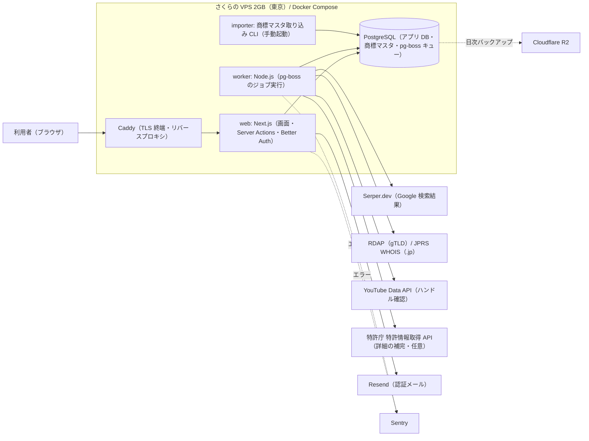

# アーキテクチャ

**最終更新**: 2026-09-23 | **採用案**: C（VPS 中心: さくらの VPS 2GB 東京 + Docker Compose）

このプロジェクトの全機能が従う、システム構成と技術スタック。各機能の `plan.md` は、この文書と `docs/nfr.md` に従う。変更するときは `speckit-architecture` の見直しモードで行う。

## 1. 前提と制約

### 要件の要約

- **利用者と規模**: 個人・中小企業の名付け担当（premises P1）。MVP 時は数十〜数百人、1 年後は 1,000 人程度（A5）。アプリのデータ（チェック・候補・結果）は小さい。一方、商標データ（商標基本マスタ）は全件を自前の DB に持つため、アプリのデータより大きくなる。ただし件数と容量は確認できていない（§9 R3）。
- **機能から見た技術要件**:
  - 個人アカウントの認証（000-app-basic）
  - 複数候補を一括で外部に問い合わせる非同期ジョブと、候補ごとの進捗表示（premises P7）
  - 商標の同一・称呼類似・区分による検索（001）
  - Google 検索の上位結果の取得（002）
  - ドメインの空き確認と、YouTube のハンドルの確認（003）
  - 商標データの定期的な取り込み
  - ファイル保存とリアルタイム通信は不要である
- **法規制と個人情報**:
  - 個人情報はアカウント情報だけである。
  - 候補名は機密情報として扱い、本人だけが閲覧でき、削除できるようにする（premises P6）。
  - 保管場所は国内が望ましいが、必須ではない（A7）。
  - 外部サービスの利用規約に反する取得はしない（§2.1）。
- **MVP の範囲と時期**: 一括チェック（商標・Google 検索・ドメイン・SNS）、比較表、履歴、ユーザーごとの利用回数の上限（premises P8）。無料で公開する（premises P9）。

### ヒアリングの回答

| ID | 項目 | 回答 |
|---|---|---|
| A1 | 使いたい / 避けたいクラウドや SaaS | 指定なし |
| A2 | MVP 時の月額予算の上限 | 〜5,000 円（外部 API の費用を含む） |
| A3 | 運用の体制 | 専任なし（開発者が兼任） |
| A4 | チームのスキルと好みの言語 | TypeScript |
| A5 | 想定規模と成長の見込み | 1 年後に利用者〜1,000 人 |
| A6 | 可用性への期待（MVP 時） | 多少止まってもよい |
| A7 | データの保管場所と規制 | 国内が望ましいが必須ではない |
| A8 | ベンダーロックインの許容度 | 移行しやすさを重視する |
| A9 | 既存の資産 | GitHub のみ |
| A10 | Instagram・TikTok・X の確認方法 | 手動確認のリンクを示す（自動判定しない） |
| A11 | 特許庁の商標データの申込名義 | まだ分からない（§9 R1 のリスクとして扱う） |
| A12 | フレームワーク、ジョブ、認証、メール | Next.js（App Router）、pg-boss、Better Auth、Resend Free |

## 2. 採用した構成

VPS 1 台の上で、Docker Compose により次の 4 つのコンテナを動かす。

- `caddy`: TLS 証明書を自動で更新し、リクエストを `web` に渡す。
- `web`: Next.js。画面、Server Actions、Better Auth による認証を担う。一括チェックの実行時は、候補ごとのジョブを pg-boss に登録する。
- `worker`: pg-boss からジョブを取り出し、外部サービスへ問い合わせて結果を DB に書く。進捗は、画面が DB の結果を定期的に読み直して表示する。
- `postgres`: アプリのデータ、商標マスタ、ジョブのキューを 1 つの PostgreSQL に置く。キューのために Redis を足さないので、メモリ 2GB でも収まる。

この構成にした理由は 4 つある。

- 予算（A2）に収まる。
- 商標マスタを置けるディスク（100GB）がある。
- 構成が標準的（コンテナと PostgreSQL）なので、クラウドへも移りやすい（A8）。
- 「多少止まってもよい」（A6）という前提なら、単一サーバーで足りる。

### 2.1 外部データの取得方針

| 対象 | 取得手段 | 規約・制約への対応 |
|---|---|---|
| 商標（同一・称呼類似・区分） | 特許庁の一括ダウンロードで「商標基本マスタ」（TSV、無料）を入手し、`importer` で PostgreSQL に取り込む。称呼で検索するための索引を自前で作る（手法は `001` の `plan.md` で決める） | J-PlatPat の画面は自動取得しない（ロボットアクセスが禁止されているため）。ダウンロードは自動化できないので、差分は開庁日ごとまたは週ごとに手作業で落とし、CLI で取り込む。検索結果を丸ごと一覧で出力する機能は作らない（デッドコピーの第三者譲渡が禁止されているため） |
| 商標の詳細（任意） | 該当商標の詳細は J-PlatPat の固定アドレスへリンクで示す。必要なら特許情報取得 API で経過情報を補う | API の上限（1 日 400〜800 件）を超えないよう、結果をキャッシュする |
| Google 検索 | Serper.dev（第三者の SERP API）。予備に SearchApi.io を置く | Google の公式 API は 2027-01-01 に終了する。事業者の停止に備え、取得部分は差し替えられるアダプタにする。同じ候補名の結果は一定期間キャッシュする |
| ドメイン（gTLD） | IANA のブートストラップと RDAP（登録済みなら 200、未登録なら 404） | 問い合わせを絞り、結果をキャッシュする |
| ドメイン（.jp） | JPRS WHOIS（ポート 43） | 「同一ドメイン名の存在確認」の目的の範囲で、低い頻度で使う。制限されたら「不明」と示す |
| YouTube | YouTube Data API の `channels.list`（`forHandle`）。無料の割り当ては 1 日 10,000 ユニット | 自動アクセスは公式 API だけにする |
| X・Instagram・TikTok | 自動では判定しない。プロフィール URL を示し、利用者が開いて確かめる（A10） | 各社の規約で、プロフィールへの自動アクセスが禁止されているため |

「空き」は断定しない。API で存在しないと出ても、凍結や予約で取得できない場合があるので、その旨を画面に明示する。

## 3. 技術スタック

| 領域 | 採用 | 理由 |
|---|---|---|
| 言語 | TypeScript（Node.js 22 LTS） | A4。画面、サーバー、ワーカー、取り込み CLI を 1 つの言語で書ける |
| フレームワーク | Next.js（App Router、`output: "standalone"`） | A12。画面とサーバー処理をまとめられ、Docker イメージにしやすい |
| パッケージ管理 | pnpm（ワークスペースで `web`、`worker`、`importer`、共通パッケージを分ける） | 3 つの実行単位で DB スキーマと型を共有するため |
| データベース | PostgreSQL 17（VPS 上のコンテナ）、拡張 `pg_trgm` | 標準技術で移行しやすい（A8）。称呼の類似検索の索引に `pg_trgm` を候補とする（採否は `001` の `plan.md` で決める） |
| ORM・マイグレーション | Drizzle ORM と drizzle-kit | 型安全で軽い。Better Auth が対応している |
| 認証・認可 | Better Auth（セッションは自前の DB に持つ） | A12。OSS で無料、利用者の情報を自分の DB に持てる。共通基盤（`000-app-basic`）で使う |
| メール送信 | Resend（Free: 月 3,000 通、1 日 100 通） | A12。認証メールだけなら無料枠で足りる。足りなくなったら Amazon SES に移る |
| ファイル保存 | なし | 機能要件にない（premises P7） |
| バッチ・ジョブ | pg-boss（PostgreSQL のキュー）、`worker` コンテナ。定期実行（キャッシュの掃除など）も pg-boss のスケジュールで行う | A12。Redis が不要で、メモリを節約できる |
| 監視・ログ・エラー通知 | Sentry（Developer、無料）でエラー、外形監視は UptimeRobot（Free）。ログは Docker のログ（ローテーションを設定） | 無料枠で足りる。UptimeRobot Free を商用に使ってよいかは確認できていない（§9 R6） |
| バックアップ | PostgreSQL を毎日 `pg_dump` し、Cloudflare R2 に送る（世代を残す）。商標マスタは再取り込みで復元できるので、バックアップの対象から外してよい | R2 は 10GB まで無料で、エグレスも無料 |
| CI/CD | GitHub Actions。PR ごとにリンター、型検査、テストを実行する。`main` へのマージで Docker イメージを GHCR に push し、SSH で VPS 上の `docker compose pull && up -d` を実行する | A9（GitHub）。追加の費用がない |
| IaC | 使わない。VPS の初期設定手順と `compose.yaml` をリポジトリで管理する | サーバーが 1 台で、IaC の効果が小さい |
| 秘密情報の管理 | GitHub Actions の Secrets と、VPS 上の `.env`（権限 600、リポジトリに含めない） | 単一サーバーで足りる。外部 API のキーを外に出さない |
| リバースプロキシ | Caddy | TLS 証明書を自動で取得・更新できる |

### 開発のコマンド

| 用途 | コマンド |
|---|---|
| テスト | `pnpm test`（Vitest）、`pnpm test:e2e`（Playwright） |
| ビルド | `pnpm build` |
| リンター・フォーマッター | `pnpm lint`（ESLint）、`pnpm format`（Prettier）、`pnpm typecheck`（`tsc --noEmit`） |
| ローカル起動 | `docker compose -f compose.dev.yaml up -d`（PostgreSQL）と `pnpm dev` |

## 4. 環境

| 環境 | 用途 | 構成の違い |
|---|---|---|
| 開発（ローカル） | 開発者の手元 | Docker Compose で PostgreSQL だけを起動し、`web` と `worker` は `pnpm dev` で動かす。外部 API はモックか開発用キーを使う。商標マスタは一部を取り込む |
| 検証 | 本番前の確認 | MVP では専用の環境を置かない。本番の VPS 上に、別の Compose プロジェクト（別 DB）で一時的に立てる |
| 本番 | 利用者向け | さくらの VPS 2GB（東京）に Caddy、`web`、`worker`、PostgreSQL を置く |

## 5. 費用の概算

- 参照日は 2026-09-23 である。
- 為替は 1 USD = 157.18 円とした。ECB の参照レート（2026-09-22 公表）から計算したクロスレートである（https://www.ecb.europa.eu/stats/eurofxref/eurofxref-daily.xml ）。
- 国内事業者の価格は税込、海外 SaaS の価格は税抜である。

| 項目 | MVP 時（月額） | 成長時（月額） | 出典 |
|---|---|---|---|
| VPS（さくらの VPS、東京） | 1,958 円（2GB） | 3,960 円（4GB） | https://vps.sakura.ad.jp/specification/ |
| Google 検索（Serper.dev） | 約 1,310 円（$50 で 5 万件、6 か月有効を月割り。最初の 2,500 件は無料） | 約 1,310〜2,620 円（月 1〜2 万件を想定） | https://serper.dev/ |
| バックアップ（Cloudflare R2） | 0 円（10GB 以内） | 0〜数十円 | https://developers.cloudflare.com/r2/pricing/ |
| メール（Resend Free） | 0 円 | 0 円。上限に近づいたら SES（1,000 通 $0.10、約 16 円） | https://resend.com/pricing 、https://aws.amazon.com/ses/pricing/ |
| エラー通知（Sentry Developer） | 0 円 | 0 円（月 5,000 エラーまで） | https://sentry.io/pricing/ |
| 外形監視（UptimeRobot Free） | 0 円 | 0 円 | https://uptimerobot.com/pricing/ |
| RDAP・JPRS WHOIS・YouTube Data API | 0 円 | 0 円（YouTube は 1 日 10,000 ユニット以内） | https://data.iana.org/rdap/dns.json 、https://developers.google.com/youtube/v3/getting-started |
| 特許庁の商標データ（一括ダウンロード） | 0 円（通信費は利用者負担） | 0 円 | https://www.jpo.go.jp/system/laws/sesaku/data/download.html |
| **合計** | **約 3,270 円** | **約 5,300〜6,600 円** | |

- ドメインの取得・更新費用は含めていない。
- 成長時は、利用者を 1 万人程度、月 1〜2 万候補のチェックと想定した。商標マスタとアプリのデータが 4GB の VPS に収まることを前提にしている。
- 長期契約にすると安くなる（ConoHa VPS 2GB は 36 か月契約で 918 円から。https://vps.conoha.jp/pricing/ ）。

## 6. 比較した案

| 観点 | A. SaaS/PaaS 中心 | B. クラウド中心 | C. VPS 中心 |
|---|---|---|---|
| 構成の概要 | Cloudflare Workers（Paid、Queues、Cron）と Supabase Pro（東京）、Resend | Google Cloud Run と Cloud SQL for PostgreSQL（f1-micro、東京）、Cloud Tasks | さくらの VPS 2GB（東京）と Docker Compose（Next.js、worker、PostgreSQL）、R2 バックアップ |
| MVP 時の月額 | 約 6,000 円（Workers $5 + Supabase Pro $25 + 検索 API）。商標マスタが Free の 500MB に収まらない見込みで、Pro が要る | 約 3,700 円（Cloud SQL 約 $12〜13 + ストレージ + 検索 API） | 約 3,270 円 |
| 成長時の月額 | 約 8,000〜10,000 円 | 約 7,500〜12,000 円（g1-small 約 $33 など） | 約 5,300〜6,600 円 |
| 運用の負荷 | 低い（マネージド） | 中程度（IAM、ネットワーク、請求の管理） | 高い（OS の更新、バックアップと復元、監視を自分で行う） |
| 拡張性・可用性の上限 | 高い | 高い（f1-micro は SLA の対象外） | 単一サーバーで、上限はプランの上位まで。障害時は復旧まで止まる |
| 移行の費用・ロックイン | 中程度（Workers と Queues の独自 API に依存する） | 低い（コンテナと PostgreSQL） | 低い（コンテナと PostgreSQL） |
| 要件への適合 | 予算を超える。Workers で Node.js の Postgres ドライバと認証ライブラリが動くかは未確認 | 予算内に収まる。ただし f1-micro（0.6GB）では商標マスタの類似検索が非力で、上位に上げると予算を超える | 予算内に収まり、商標マスタを置けるディスクがある |

### 却下した案と理由

- **A. SaaS/PaaS 中心**: MVP 時の月額が予算（5,000 円）を超える。商標マスタを DB に持つと、Supabase や Neon の無料枠を超える見込みである。予算が月 1 万円以上に広がり、運用の手間を減らしたくなったら再検討する。
- **B. クラウド中心**: MVP 時は予算内に収まる。ただし、類似検索に十分な DB（g1-small 以上）にすると予算を超える。可用性の要求が「常時稼働」に上がり、予算が増えたら再検討する。同じコンテナ構成なので、C から移りやすい。
- **Vercel Hobby**: 規約で商用利用が禁止されている（https://vercel.com/docs/limits/fair-use-guidelines ）。

## 7. 見直しの条件

次のいずれかに当てはまったら、`speckit-architecture` の見直しモードで構成を見直す。

- 月間アクティブ利用者が 1,000 人を超え、応答時間の目標（`docs/nfr.md`）を満たせなくなった。
- VPS のメモリ使用率が常に 80% を超える、またはディスク使用率が 70% を超えた（4GB プランに上げるか、DB を分ける）。
- 月額の合計が 5,000 円（MVP 時）を超える見込みになった。
- 可用性の要求が「常時稼働」に上がった（B 案のマネージド DB へ移ることを検討する）。
- Serper.dev の提供停止や大幅な値上げがあった（SearchApi.io などへ差し替える）。
- 特許庁の一括ダウンロードの申込が通らなかった、または利用条件が変わった（§9 R1）。
- 有料プラン（backlog BL-001）を入れることになった（決済サービスを追加する）。

## 8. 出典

参照日はすべて 2026-09-23 である。

- さくらの VPS 仕様・料金: https://vps.sakura.ad.jp/specification/
- ConoHa VPS 料金: https://vps.conoha.jp/pricing/
- Hetzner Cloud: https://www.hetzner.com/cloud/cost-optimized/
- Cloudflare Workers 料金: https://developers.cloudflare.com/workers/platform/pricing/
- Cloudflare Queues 料金: https://developers.cloudflare.com/queues/platform/pricing/
- Cloudflare R2 料金: https://developers.cloudflare.com/r2/pricing/
- Supabase 料金: https://supabase.com/pricing
- Neon 料金: https://neon.com/pricing
- Vercel 料金・利用規定: https://vercel.com/pricing 、https://vercel.com/docs/limits/fair-use-guidelines
- Google Cloud Run 料金: https://cloud.google.com/run/pricing
- Cloud SQL 料金: https://cloud.google.com/sql/pricing
- AWS 料金（Price List API, ap-northeast-1）: https://pricing.us-east-1.amazonaws.com/offers/v1.0/aws/index.json
- Amazon SES 料金: https://aws.amazon.com/ses/pricing/
- Resend 料金: https://resend.com/pricing
- Sentry 料金: https://sentry.io/pricing/
- UptimeRobot 料金: https://uptimerobot.com/pricing/
- Better Auth: https://github.com/better-auth/better-auth
- Serper.dev: https://serper.dev/
- SerpApi 料金: https://serpapi.com/pricing
- SearchApi.io 料金: https://www.searchapi.io/pricing
- Google Custom Search JSON API（終了の告知）: https://developers.google.com/custom-search/v1/overview
- Google と SerpApi の訴訟: https://www.searchenginejournal.com/court-dismisses-googles-dmca-claims-against-serpapi/583033/
- 特許庁 特許情報取得 API: https://www.jpo.go.jp/system/laws/sesaku/data/api-provision.html 、API 一覧 https://ip-data.jpo.go.jp/files/20260302_API一覧.pdf 、利用の手引き https://www.jpo.go.jp/system/laws/sesaku/data/document/api-provision/api_handbook_v2.0.pdf 、規約 https://www.jpo.go.jp/system/laws/sesaku/data/document/api-provision/api_terms_of_use.pdf
- 特許庁 一括ダウンロード: https://www.jpo.go.jp/system/laws/sesaku/data/download.html 、規約 https://www.jpo.go.jp/system/laws/sesaku/data/document/download/terms_of_use_bulk_data_download_service.pdf 、提供データ https://www.jpo.go.jp/system/laws/sesaku/data/keikajoho/index.html
- J-PlatPat 利用上の案内: https://www.inpit.go.jp/j-platpat_info/guide/j-platpat_notice.html
- IANA RDAP ブートストラップ: https://data.iana.org/rdap/dns.json
- JPRS WHOIS 利用上の注意: https://jprs.jp/about/dom-search/jprs-whois/whois-guide-notes.html
- YouTube Data API channels.list: https://developers.google.com/youtube/v3/docs/channels/list
- X 利用規約: https://x.com/en/tos 、X API 料金: https://docs.x.com/x-api/getting-started/pricing
- Instagram 利用規約: https://help.instagram.com/581066165581870
- TikTok 利用規約: https://www.tiktok.com/legal/page/row/terms-of-service/en

## 9. リスクと未確定事項

| ID | 内容 | 影響 | 対応 |
|---|---|---|---|
| R1 | 特許庁の一括ダウンロードは審査制で、個人名義だと私的利用に限られる。法人名義での申込ができるかは未定である（A11） | 商標の照合（`001`）ができない | 公開の前提条件とする。`001` の仕様化の前に申込の見通しを確かめる。通らなければ見直しの条件（§7）に従う |
| R2 | 自前で作る称呼類似の精度は、専門ツールに及ばない | 見落としによる誤認 | 画面で「簡易チェック」であることを明示する（premises P6） |
| R3 | 商標マスタの件数と容量を確認できていない | VPS のディスクとメモリが足りない可能性 | 申込後に実データで測り、足りなければ 4GB プランに上げる |
| R4 | Google と SERP 事業者の訴訟が続いている | Google 検索のチェック（`002`）が止まる | 取得部分をアダプタにして差し替えられるようにする |
| R5 | JPRS WHOIS には目的と頻度の制限がある | .jp の確認が一時的にできなくなる | キャッシュして頻度を抑え、制限されたら「不明」と示す |
| R6 | UptimeRobot Free を商用に使ってよいか確認できていない | 規約違反になる可能性 | 公開前に確かめる。使えなければ有料プランか別のサービスにする |

## 変更履歴

| 日付 | 変更内容 | 理由 |
|---|---|---|
| 2026-09-23 | 初版 | — |
