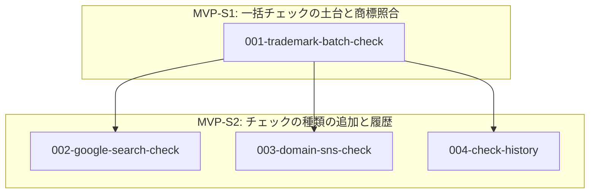

# 推奨仕様化順

`docs/feature/` の全機能を、**区分（MVP → 拡張）と依存関係で並べた `/speckit-specify` に渡す順序の目安**。

> ⚠ **このファイルは進捗を持たない。** 進捗は各機能ファイルの状態欄と `specs/<機能>/tasks.md` が正本。
> 各行の番号 `N` とファイル名の `NNN` は想定順序（採番）で、`speckit-feature` / `speckit-coding` / `speckit-all` が `specs/NNN-<slug>` の番号として使う。**振り直さない。**

## この順序の作り方

各機能ファイルの `**区分**` と `**依存**` を読み、MVP を先に、それぞれの中を依存の段階順に並べた。
被参照数と段階分けは次のコマンドで再現できる。

```bash
python3 .claude/skills/speckit-concept-2-feature/scripts/validate.py docs/feature --graph
```

### 被参照数の多い順（律速要素）

| 被参照 | 機能 | 意味 |
|---|---|---|
| 3 | `001-trademark-batch-check` | チェック・候補の実体と比較表を持ち、ほかのチェックの種類と履歴がすべてこれに載る |

## 段階分け



### MVP

#### MVP-S1: 一括チェックの土台と商標照合

- **1. [候補名の一括チェックと商標照合](./001-trademark-batch-check.md)**: 複数候補を一括実行し、商標の同一・称呼類似を比較表に示す

#### MVP-S2: チェックの種類の追加と履歴

- **2. [Google 検索の使用状況チェック](./002-google-search-check.md)**: Google の上位結果と「該当あり／なし」の目安を比較表に加える
- **3. [ドメイン・SNS の空き確認](./003-domain-sns-check.md)**: 選んだ TLD と 4 つの SNS の空きを比較表に加える
- **4. [チェック履歴の管理](./004-check-history.md)**: 過去のチェックを本人だけが見返し、削除できる

### 拡張

（なし。拡張の候補は [../concept/backlog.md](../concept/backlog.md) にある）
