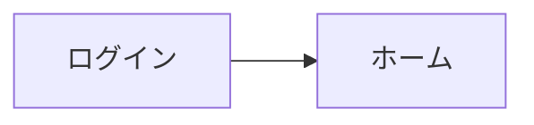

# 体験の設計: <サービス名>

**作成日**: YYYY-MM-DD | **最終更新**: YYYY-MM-DD

<!--
振る舞いの共通の決め事を書く（見た目は DESIGN.md）。
画面一覧は、機能ごとの画面仕様（specs/<NNN-name>/ui.md）が詳細の正本であり、ここは全体の目次として使う。
画面 ID は SCR-<機能番号 3 桁>-<連番 2 桁>（例: SCR-001-01）。機能番号は docs/feature/ のファイル名の先頭の番号である。
-->

## 情報設計

- **全体の構成**: 主なナビゲーション（グローバルメニューの項目など）と、ロールごとに見える範囲
- **入口**: ログイン後に最初に表示する画面、ロールごとの違い

## 画面一覧

| ID | 画面 | 機能 | ロール | 状態 |
|---|---|---|---|---|
| SCR-000-01 | ログイン | 000-app-basic | 全員 | 構想 |

<!-- 状態: 構想（立ち上げで挙げただけ）/ 仕様化済み（ui.md がある） -->

## 画面遷移

<!-- 主な流れだけを書く。Mermaid を使ってよい -->

## 状態のパターン

| 状態 | 表示の方針 |
|---|---|
| 空（データがない） | 何をすればよいかと、最初の操作への導線を示す |
| 読み込み中 | 1 秒を超えそうなら、読み込み中であることを示す |
| エラー | 何が起きたか、利用者に何ができるかを示す。技術的な詳細は出さない |
| 権限がない | 権限がないことと、誰に頼めばよいかを示す |
| 成功 | 操作の結果を短く知らせる |

## 言葉づかい

- **文体**: 例: です・ます調、利用者を「あなた」と呼ばない
- **用語**: 画面で使う用語と、使わない言い換え（`docs/feature/premises.md` の用語と合わせる）
- **エラーの文言**: 例: 「〜できませんでした。〜してください。」の形

## アクセシビリティ

- **水準**: `docs/nfr.md` の `NFR-UX` に従う（例: WCAG 2.2 AA）
- **最低限守ること**: キーボードだけで操作できる、フォーカスが見える、画像に代替テキスト、フォームの項目に名前、色だけで情報を伝えない
- **確かめ方**: 例: 自動検査（axe など）とキーボード操作の手動確認

## 変更履歴

| 日付 | 内容 | 理由 |
|---|---|---|
| YYYY-MM-DD | 作成 | — |
