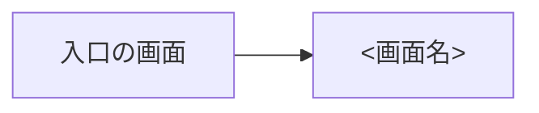

# 画面仕様: <FEATURE_NAME>

**対象**: UI あり | **作成日**: YYYY-MM-DD | **モック**: なし

<!--
この機能の画面を、spec.md の要件（FR-xxx）と対応づけて書く。見た目と振る舞いの共通の決め事は
docs/design/DESIGN.md と EXPERIENCE.md に従い、ここには機能に固有のことだけを書く。
技術（フレームワーク、コンポーネントのライブラリ、API）は書かない。それは plan.md で決める。
画面のない機能は、ヘッダを「**対象**: UI なし」にし、理由を 1 行書いて以降の節を省く。
--with-mock のときは、ヘッダの「モック」に Claude Design のアーティファクトの URL を書く。
-->

## 画面一覧

| ID | 画面 | 目的 | 対応する要件 | ロール |
|---|---|---|---|---|
| SCR-NNN-01 | <画面名> | <この画面で利用者が達成すること> | FR-001, FR-002 | <ロール> |

## 画面遷移

## 画面ごとの仕様

### SCR-NNN-01 <画面名>

- **表示する情報**: 項目と並び順、件数が多いときの扱い（ページ送りなど）
- **操作**: ボタンやリンクと、その結果（どの画面に移るか、何が起きるか）
- **入力と検証**: 項目、必須かどうか、検証の条件、エラーの文言
- **状態**: 空 / 読み込み中 / エラー / 権限がない のときの表示（`EXPERIENCE.md` の方針と違う点だけ）
- **使うコンポーネント**: `DESIGN.md` のコンポーネントの名前
- **端末による違い**: スマートフォンで変わる点
- **アクセシビリティ**: この画面に固有の注意（並べ替えできる表の読み上げなど）

## 文言

| 場所 | 文言 |
|---|---|
| <ボタン、見出し、通知など> | <文言> |

## 未決事項

- なし
